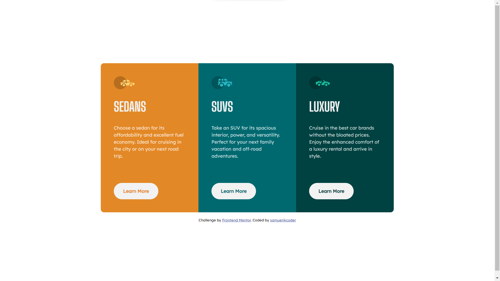

# Frontend Mentor - 3-column preview card component solution

This is a solution to the [3-column preview card component challenge on Frontend Mentor](https://www.frontendmentor.io/challenges/3column-preview-card-component-pH92eAR2-). Frontend Mentor challenges help you improve your coding skills by building realistic projects. 

## Table of contents

- [Overview](#overview)
  - [The challenge](#the-challenge)
  - [Screenshot](#screenshot)
  - [Links](#links)
- [My process](#my-process)
  - [Built with](#built-with)
  - [What I learned](#what-i-learned)
  - [Continued development](#continued-development)
  - [Useful resources](#useful-resources)
- [Author](#author)

## Overview

### The challenge

Users should be able to:

- View the optimal layout depending on their device's screen size
- See hover states for interactive elements

### Screenshot

### Links

- Solution URL: [Add solution URL here](https://github.com/samuerikcoder/3-column-preview-card-component-challenge-on-Frontend-Mentor)
- Live Site URL: [Add live site URL here](https://your-live-site-url.com)

## My process

### Built with

- Semantic HTML5 markup
- CSS custom properties
- Flexbox
- CSS Grid
- Mobile-first workflow

### What I learned

Grid System: The code demonstrates the effective use of CSS Grid to create a responsive layout for the card components. The .card-columns class uses display: grid and grid-template-columns to define a three-column grid, allowing the cards to be arranged in a visually pleasing way.

Flexibility with Flexbox: Within each card, the content is organized using Flexbox. The .card class utilizes display: grid and gap to create a flexible and evenly spaced layout. The Flexbox model is powerful for arranging and aligning elements within containers.

Project Planning and Structure: The HTML structure is well-organized, making use of semantic tags like <article>, <section>, and 
. The code shows a clear separation between the main content and the attribution section, enhancing code readability and maintainability.

Responsiveness: The code demonstrates a responsive design approach using media queries. By defining different styles for different screen sizes, the layout adapts to varying viewport widths. In this case, the grid layout changes from a single column on small screens to a three-column layout on larger screens.

### Continued development

In the next few codes I intend to explore more concepts of the flex box and the grid. I plan to start deploying animations with CSS as well and write simpler and more straightforward code.

### Useful resources

- [Example resource 1](https://youtu.be/B2WL6KkqhLQ) - This helped me with Project planning, flex-box, grid container, responsiveness and css variables. I really liked this pattern and will use it going forward.

## Author

- Frontend Mentor - [@samuerikcoder](https://www.frontendmentor.io/profile/samuerikcoder)